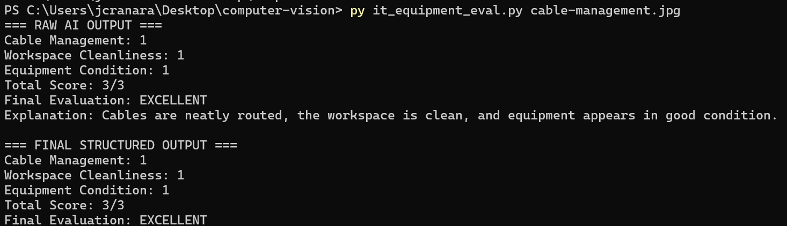
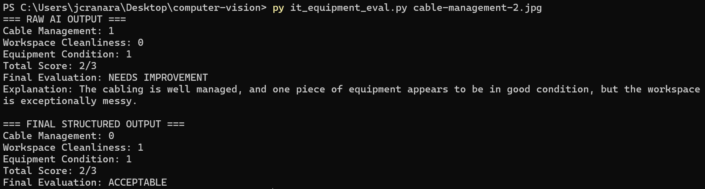

# 🖥️ IT Equipment Status Evaluator Using Vision AI

## 📌 Overview
This project is an AI-powered image evaluation system that analyzes IT workspace setups (such as cable management and equipment condition) using a vision-language model.

Unlike simple image classifiers, this system evaluates images based on multiple criteria, assigns scores, and produces a final decision, simulating a real-world inspection process.

---

## 🚀 Features

- 📷 Image-based evaluation
- 🤖 AI-powered analysis (Ollama + Gemma 3 Vision Model)
- 📊 Structured scoring system
- 🧠 Decision-making output (not just classification)
- ⚙️ Hybrid AI + rule-based evaluation

---

## 🧠 Evaluation Criteria

Each image is evaluated based on the following:

| Criterion | Score |
|----------|--------|
| Cable Management | 0 or 1 |
| Workspace Cleanliness | 0 or 1 |
| Equipment Condition | 0 or 1 |

---

## 📊 Final Evaluation Logic

| Total Score | Evaluation |
|------------|-----------|
| 3/3 | EXCELLENT |
| 2/3 | ACCEPTABLE |
| 0–1/3 | NEEDS IMPROVEMENT |

---

## 🛠️ Technologies Used

- Python 🐍
- Ollama (Local AI Model Server)
- Gemma 3 Vision Model (`gemma3:4b`)
- Requests Library

---

## ⚙️ How It Works

1. The image is converted into Base64 format
2. It is sent to the Ollama Vision model
3. The AI generates a description of the image
4. Python processes the text output
5. The system assigns scores based on detected keywords
6. A final evaluation is generated

---


## 📷 Sample Images

| Image | Description |
|------|------------|
| `cable-management.jpg` | ✅ Proper cable management |
| `cable-management-2.jpg` | ❌ Messy and unorganized setup |

---


## 📸 Screenshots / Results

### ✅ Image 1 — Proper Cable Management



**Result:**
---

### ❌ Image 2 — Poor Cable Management




**Result:**

## ▶️ How to Run

### Step 1: Start Ollama Server

```bash
ollama serve
```

### Step 2: Load the Model
```bash
ollama run gemma3:4b
```
Wait until it loads, then press:
```bash
CTRL + C
```

### Step 3: Install Dependencies
```bash
pip install requests
```

### Step 4: Run the Evaluator
Run for Image 1:
```bash
py it_equipment_eval.py cable-management.jpg
```
Run for Image 1:
```bash
py it_equipment_eval.py cable-management-2.jpg
```

Example Output
```bash
=== FINAL STRUCTURED OUTPUT ===

Cable Management: 1
Workspace Cleanliness: 1
Equipment Condition: 1
Total Score: 3/3
Final Evaluation: EXCELLENT
```

Notes
- First run may take longer (30–90 seconds)
- Ollama must be running before executing the script
- Performance depends on hardware (CPU vs GPU)

Author: Jericho James C. Ranara


